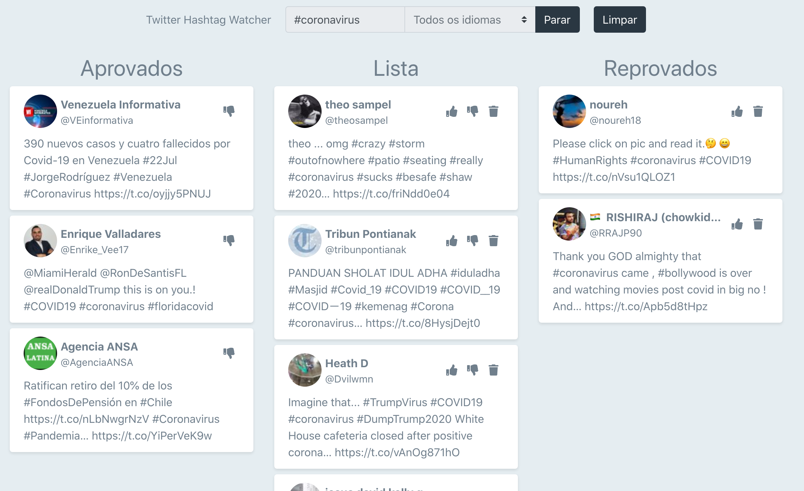
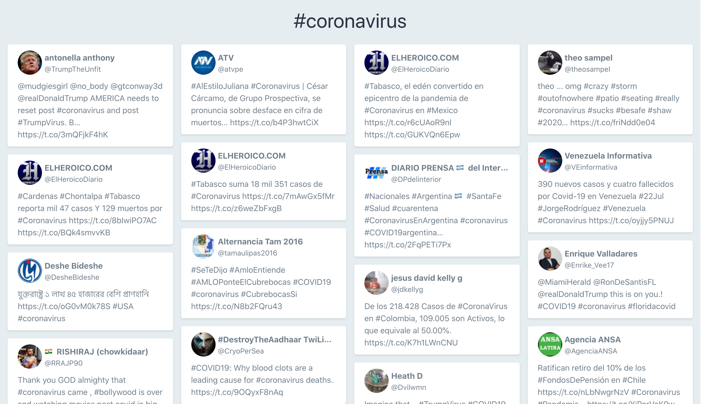

# Twitter Hashtag Watcher (Backend)

## Sobre o projeto

O objetivo é criar um aplicação controle que receba tweets com determinada hashtag e que, após serem aprovados, sejam mostrados em um telão.

O backend da aplicação foi feito em Node.js, usando websockets para comunicação com o frontend e a biblioteca Twit para fazer a stream dos tweets - também fazendo uso de websockets.

O front end da aplicacao está disponível [aqui](https://github.com/viclen/twitter-hashtag-watcher-frontend).

## Demo

A imagem a seguir mostra a tela de moderaçao dos tweets:

E essa é a visualização do telão.

## IA

A inteligência artificial desse projeto foi feita usando duas ferramentas: Bert e Vader. Vale destacar que a única linguagem disponível no momento é o inglês.

### Bert - Natural Language Processing

A IA da google para processamento, compreensão e análise de linguagem natural. Esse recurso foi desenvolvido em python e está disponível [aqui](https://github.com/viclen/nlp-twitter-python).

### Vader Sentiment Analysis

Em conjunto com a IA de linguagem natural, foi usado o [VaderSentiment](https://github.com/cjhutto/vaderSentiment) para fazer a análise do tweet dentro do próprio servidor Node.js.

## Primeiros passos

Antes de iniciar o servidor, edite o arquivo `.env-example` colocando seus dados para a API do Twitter*. Após isso, renomeie o arquivo para `.env`.

*Se você ainda não tem seus dados de acesso à API do Twitter, consiga-os [neste link](https://developer.twitter.com).

### Instalação

Para instalar as dependências do projeto, basta rodar o seguinte comando:

Usuários de yarn:
`yarn`

Usuários de npm:
`npm install`

## Comandos

### Rodar servidor

Usuários de yarn:
`yarn start`

Usuários de npm:
`npm run start`

### Fazer a build do projeto

Usuários de yarn:
`yarn build`

Usuários de npm:
`npm run build`

Os arquivos da build serão salvos na pasta dist.
